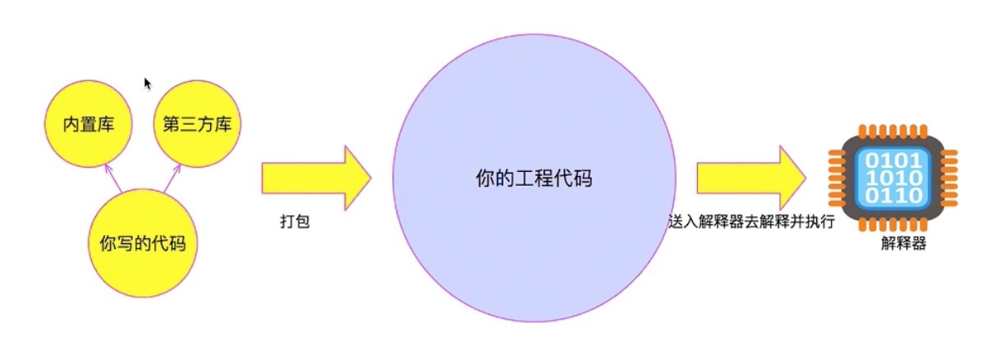

### JS第一课总结：

#### 1运行环境（Nodejs和浏览器）

我们写了一份代码，放到运行环境里面，运行环境为我们提供所需要的各种服务如用V8引擎来执行代码，提供内置库来满足我们的需求等。需要注意的是：JavaScript有两种运行环境，Nodejs和浏览器，这两种运行环境是不同的，就像动物和植物的生长环境的区别。

#### 2 V8引擎

V8引擎属于运行环境的一部分，是运行环境的核心，负责执行我们所写的代码，让代码跑起来，得到我们的结果。

#### 3 内置库

内置库属于运行环境的一部分，为我们提供一系列运行代码所需要的服务。比如：alert()

#### 4第三方库

不属于运行环境的一部分，是或由第三方的公司开发，或由个人开发，或收费的，或开源的服务，目的是为更好的满足我们的需求，提供让我们的业务更牛逼，更好的服务，让我们不需要重造轮子。

#### 5 编译器/解释器

编译器：将我们所写的正确的代码，转换成机器能理解的机器代码，让我们的代码变得可执行。

解释器：对我们所写的代码进行这个过程，解释-运行-解释下一行代码-运行下一行代码。。。。，好处是开发速度快，省略了编译这一步，但是运行速度慢了，因为运行时是边解释边执行，不像运行编译好的机器代码一把梭子下去。

#### 6 如何学号JS

1 掌握编程语言，运用编程的方式调用服务来完成自己的需求。（初学者，目前努力的方向）

2 了解和掌握重要的服务能力，使其能够满足自己的业务。（提高）

3 善于比较分析服务/技术之间的差异，用最好的方式实现自己的业务。 （进阶）

#### 7 用类比的来推导JS框架

我们（客户）写了代码（申请表），交给运行环境（银行柜台），运行环境里面的编译器（员工A），先审核，检查我们的代码，没问题了将处理好的文件（编译文件）就交给V8引擎（员工B）去执行，期间V8引擎调用内置库里面的服务（比如打印机），或许还有第三方库的服务（比如警察局办证），最后输出一个结果（给我们一个结果）

#### 8 代码执行流程

首先我们写代码，用编程的方式，按照自己的需求，写要用到什么内置库，什么第三方库的服务，接着交给编译器进行预处理，得到一个编译文件，接着给V8引擎执行，调用内置库，第三方库的服务，然后得出一个结果。