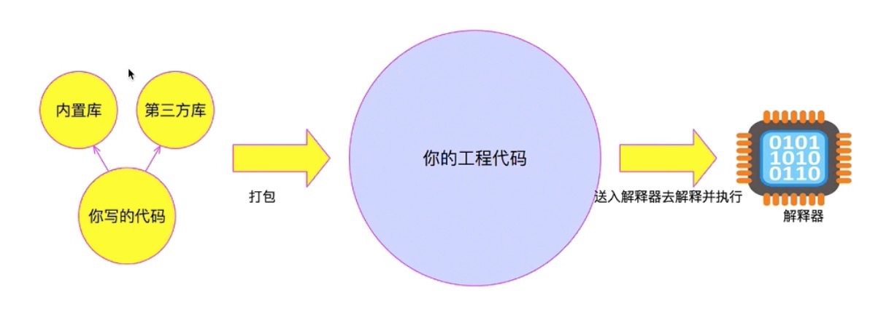

## 写一篇总结
听完课，感受还是颇深的，老师讲的还不错，我觉得最好的就是接待代码如何运作的那个图，就是在ppt中多次提到的那张图。下面试根据老师的提示写的总结

### 类比代码执行流程
老师拿银行开户的流程类比代码执行流程，还是很恰当的。
由简单的 输入 执行 和 输出。扩展到 运行环境，内置服务和第三方库。类比我觉得很好，也很容易理解。
我觉得也没啥问题，但总感觉在开户流程中，任何一个环节出错了，都会反馈到用户。在第三第四次升级中，我似乎并未体看到这一点。这一点应该可以类比为程序中出现的错误处理或者抛出异常吧。

###  运行环境
这里的运行环境，应该就是代码的执行环境。类比人所生活的环境，代码运行也处在一定的环境中的。
老师提到 JavaScript的运行环境有两种，一种是浏览器，一种是node环境。如同人类的生存环境 比如说地球吧，为人类提供光照，食物 和 水等必要的生存条件，JavaScript的运行环境也为JavaScript代码的执行提供必要的条件支持，比如V8引擎，比如内置服务等。

###  V8引擎

> V8是一个由美国Google开发的开源JavaScript引擎
> 在运行JavaScript之前，相比其它的JavaScript的引擎转换成字节码或解释执行，V8将其编译成原生机器码（IA-32, x86-64, ARM, or MIPS CPUs），并且使用了如内联缓存（inline caching）等方法来提高性能。

由此可见，V8引擎大大提高了JavaScript代码的执行速度，所为引擎就类比汽车的发动机，V8印象中指的也是发动机（8缸发动机，在汽车运行中可以提供更大动力），估计V8引擎也是这么来的吧。当然只是个人臆测。

###  编译器/解释（执行）器 
老师已经讲到，JavaScript是解释性语言，没有明显的编译行为。
而一般的C，C++，Objective-C 等都是变异性语言，其特点是有明显的编译过程。先编译，编译通过后才执行。
而诸如JavaScript解释性语言一般是边编译边执行。
编译器就是将写的代码（通常是高级语言，更接近自然语言）编译成机器能读的懂的机器语言。
> 一个现代的编译器的主要工作流程：源代码 - 预处理 - 编译器 - 目标代码 - 连接器 - 可执行程序。

执行器 就是直接执行编译过的代码文件

###  内置库 
内置库 通常都是环境自带的内置服务，提供开发所需的基本功能，包括基本的数据结构，模块，函数，等。

###  第三方库
第三方库通常是提供一套接口，供开发者使用，而这些接口通常已经实现了许多功能，只需要开发者简单的配置开发即可实现自己的业务需求，也就是说第三方库的很大一个作用就是提高开发效率。即拿来主义。站在巨人的肩膀上进行开发，相比于自己从头做起，当然是事半功倍。
下面是老师给的建议：
>	第三方库一般都是指同种语言开发的拓展功能，以满足多样化的需求。当然不排除会用其他语言开发第三方库供JS语言编写的代码来使用。比如：用C语言写一个高级算法（因为C语言效率更高），然后开发接口给JS用。那么这个接口比如满足JS语言对C语言调用规范。即：两种不同语言之间的调用，要满足一定的规范。这种规范一般情况只能是这两种语言相互认可。。python和C之间的掉拥又会有他们自己的规范。在绝大多数情况下，JS不太会用到其他语言的开放库。在学习过程中只聚焦在JS的第三方库即可！

###  学习JS的方向
想作为一个开发人员，有时候单一的了解前端或者后端是远远不够的，我学习的JS方向是希望既了解前端又了解后端。
并能独立完成开发简单的开发任务。

